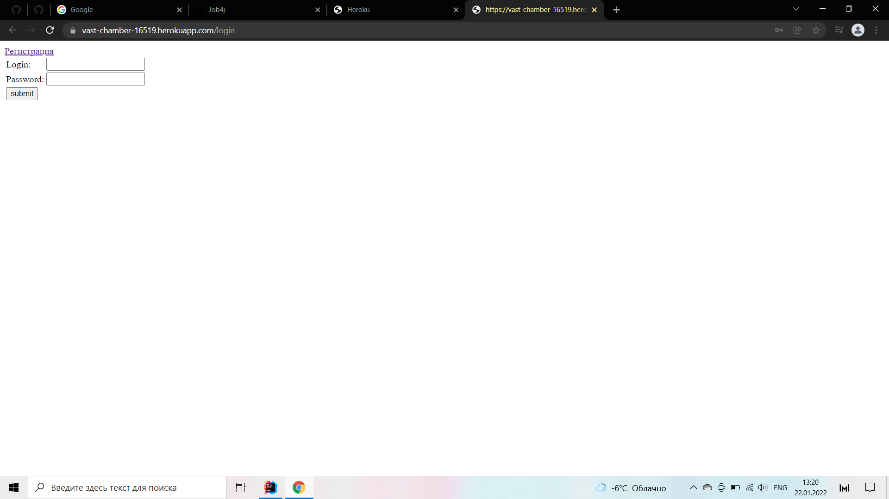
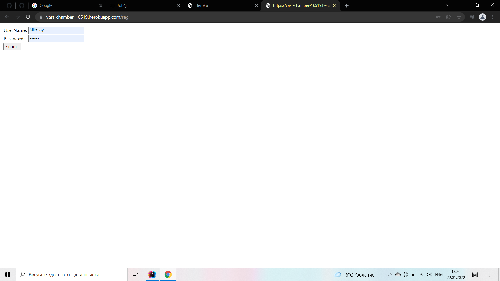
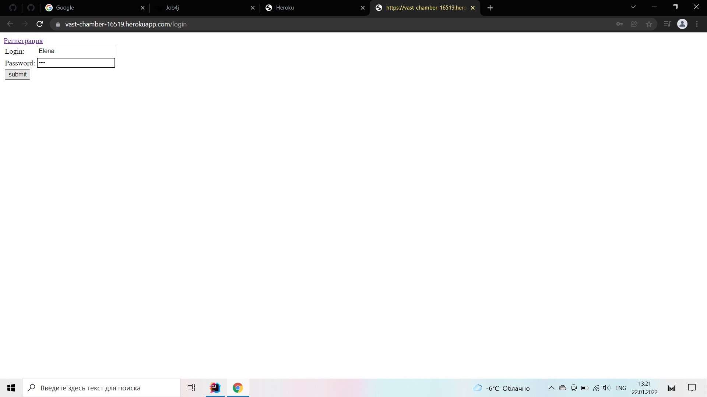
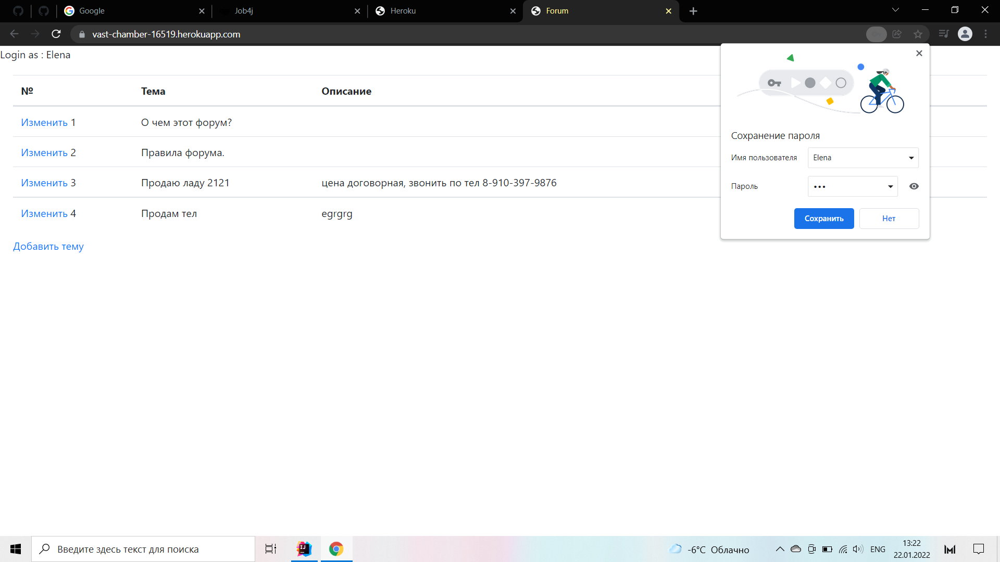
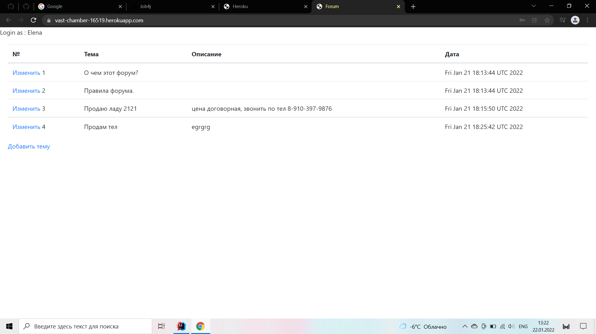
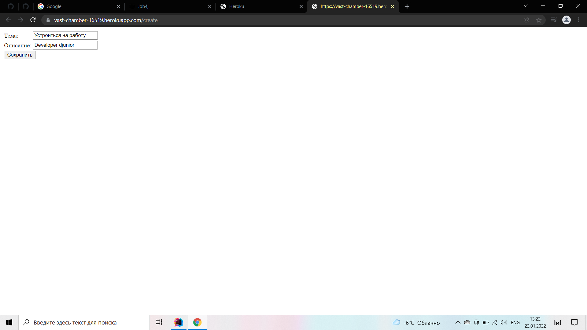
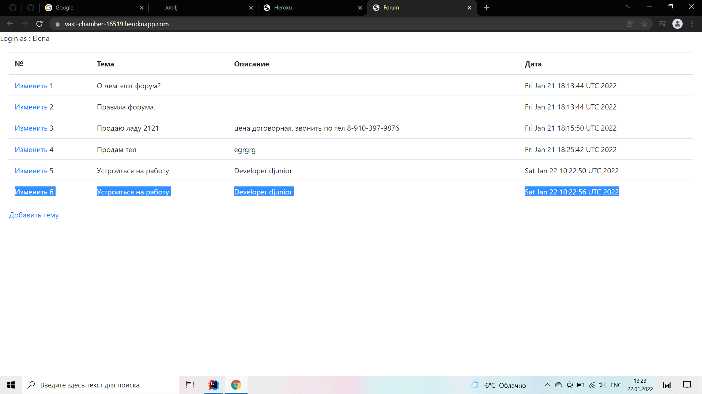
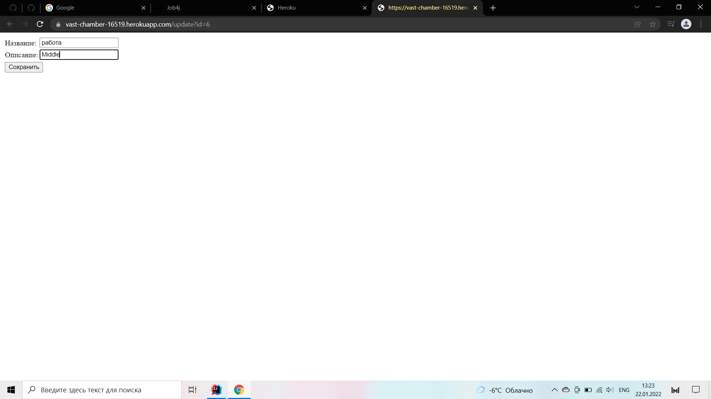
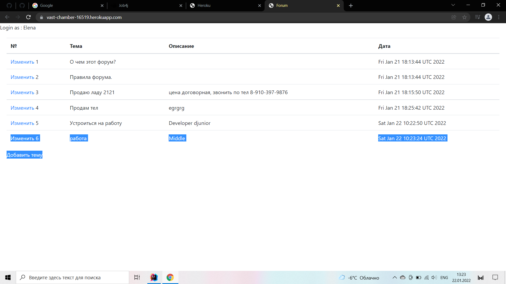
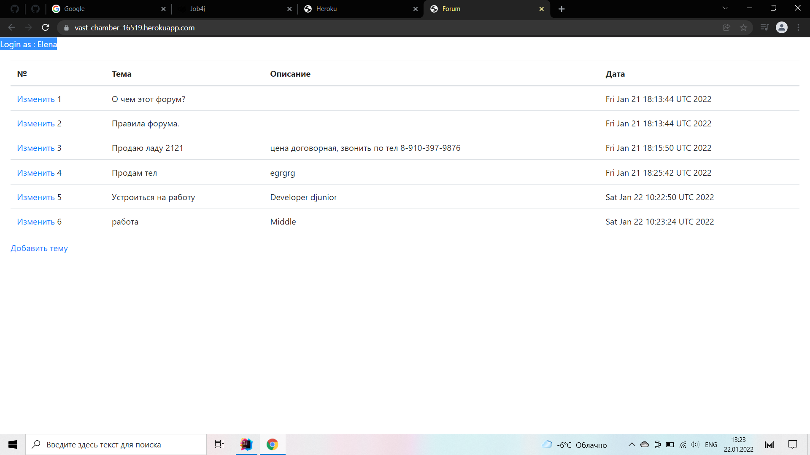

Проект основан на принципе форума, переписка, тема, описание, время и дата.

Я использовал для развертывания проекта HEROKU
также:
1 - Spring boot
2 - spring test
3 - spring mock
4 - spring liquibase
5 - HTML
6 - JSTL
7 - CHECKStILE
8 - MAVEN
9 - spring security

